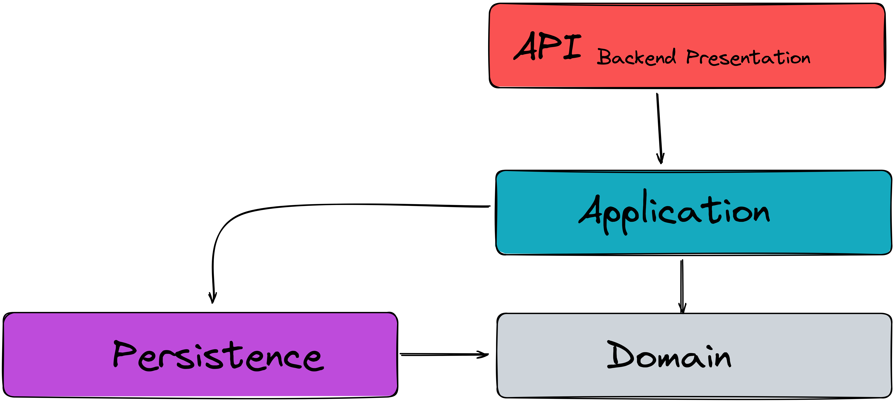

# Eventsocity
Eventsocity is a platform for grouping people one different events and activites.

> ## Backend Architecture

#### API Project:
- Responsible for receiving the HTTP requests and sending back the response to client apps.
- Its the Presentation layer of the backend architecture. 
- Has a dierct dependency on the `Application` project.
- Has a transitive dependency on both the `Domain` and the `Persistence` project.
- Its a `webAPI` project type.

#### Application Project:
- Responsible for processing the bussines logic and use cases of the app.
- Has a dependency on the `Domain` project in order to handle the user-cases.
- Has a dependency on the `Persistence` project in order to use abstractions to deal with DB.
- Its a `class library` project type.

#### Domain Project
- The center of the app.
- Contains all the business entities/domains including the domain entity state and behaviour.
- Has no dependencies on other projects.
- Its a `class library` project type.

#### Persistence Project
- Responsible for handling the connection to the database layer.
- Converting the C# code to sql queries to deal with database.
- Has a dependency on the `Domain` project in order to persist the domain entities into the database.
- Its a `class library` project type.
